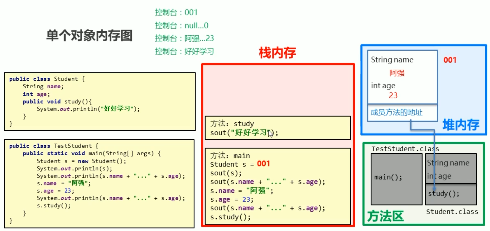
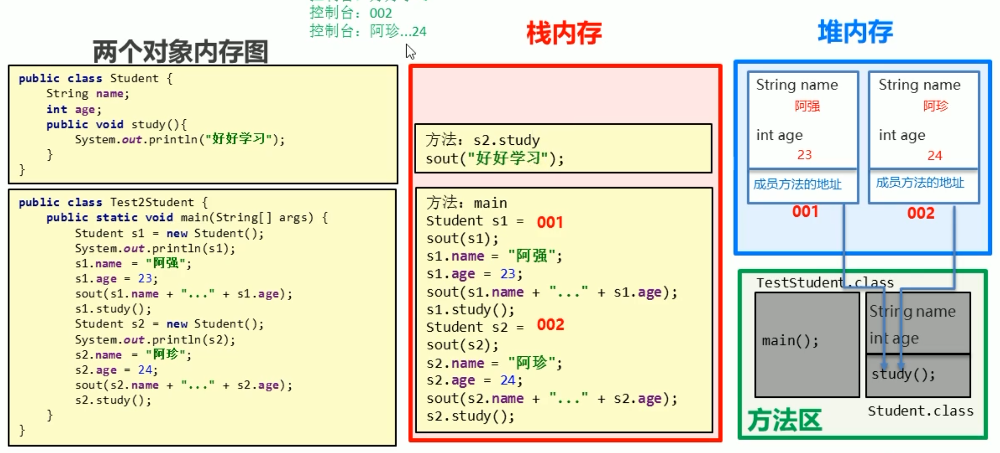
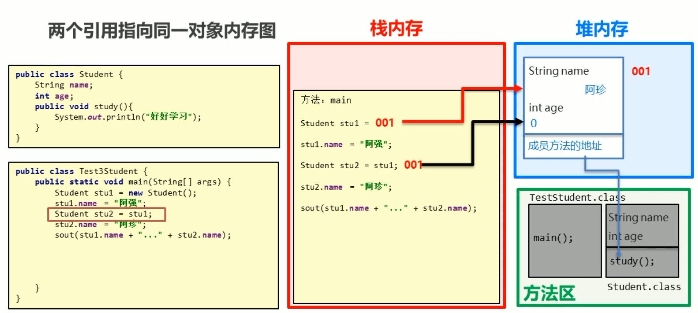

# 类和对象

------

## 面向对象和面向过程的思想对比 : 

- **面向过程 ：**以过程为中心，实现功能的每一步，都是自行实现
- **面向对象 ：**以对象为中心，通过指挥对象实现具体的功能

## 类和对象的关系

客观存在的事物皆为对象 ——万物皆对象。**类是对事物的一种描述，对象则为具体存在的事物**。

* 类是对现实生活中一类具有共同属性和行为的事物的抽象
* 类是对象的数据类型，类是具有相同属性和行为的一组对象的集合
* 简单理解：类就是对现实事物的一种描述
* 类的组成：属性：指事物的特征，例如：事物（品牌，价格，尺寸）、行为：指事物能执行的操作，例如：事物（打电话，发短信）

## 类的定义【应用】

类的组成是由属性和行为两部分组成

* **属性：**在类中通过**成员变量**来体现（类中方法外的变量）
* **行为：**在类中通过**成员方法**来体现（和前面的方法相比去掉static关键字即可）

**类的定义步骤：**

```java
package zsMethodBasic;

public class Dev {
	// 编写类的成员变量
    // 成员变量: 跟之前定义变量的格式一样, 只不过位置发生了改变, 类中方法外
	String name;
	int age;
	String Language;
	// 编写类的成员方法
	// 成员方法: 跟之前定义方法的格式一样, 只不过去掉了static关键字.
	public void code() {
		System.out.println("写bug");
	}
}
```

### 对象的创建和使用

* **创建对象的格式：**

```java
类名 对象名 = new 类名();
```

* **调用成员的格式：**

```java
对象名.成员变量; // 使用成员变量
```

```java
对象名.成员方法(); // 使用成员方法
```

```java
package zsMethodBasic;

public class Developer {
	public static void main(String args[]) {
		// 类名 对象名 = new 类名();
		Dev d = new Dev();
		// 对象名.变量名
		System.out.println(d.name);
		System.out.println(d.age);
		// 对象名.方法名();
		d.code(); // 写bug
	}
}
```

## 对象内存图

打印对象名会打印对象内存地址。

### 单个对象内存加载过程【理解】

使用类的时候将字节码文件加入方法区。有new就进堆内存开辟地址。



### 多个对象内存图【理解】

后续创建对象 `.class` 字节码文件不需要重复加载。



多个对象在堆内存中，都有不同的内存划分，成员变量存储在各自的内存区域中，成员方法多个对象共用的一份

### 两个引用指向同一对象内存



当多个对象的引用指向同一个内存空间（变量所记录的地址值是一样的）只要有任何一个对象修改了内存中的数据，随后，无论使用哪一个对象进行数据获取，都是修改后的数据。

### 垃圾回收：

堆内存中，对象或数组产生的地址，通过任何方式都不能被找到后，会被判定为内存中的垃圾。且在空闲时被 Java 垃圾回收器自动清理。

## 成员变量和局部变量

| 区别           | 成员变量       | 局部变量                           |
| -------------- | -------------- | ---------------------------------- |
| 类中位置不同   | 类方法外       | 方法内或者方法声明上（形参）       |
| 内存中位置不同 | 堆内存         | 栈内存（在方法上，且方法会入栈）   |
| 生命周期不同   | 随对象         | 随方法调用存在，方法弹栈消失       |
| 初始化值不同   | 有默认初始化值 | 没有默认初始化值。先定义后赋值使用 |

## 封装

### private关键字

private 是一个修饰符，可以用来修饰成员（成员变量，成员方法）。被 private 修饰的成员，只能在本类进行访问。

针对 private 修饰的成员变量，如果需要被其他类使用，提供相应的操作：

- 提供 `get变量名()` 方法，用于获取成员变量的值，方法用 public 修饰
- 提供 `set变量名(参数)` 方法，用于设置成员变量的值，方法用 public 修饰

### this关键字【应用】

**概述 :** this修饰的变量用于指代成员变量，其主要作用是（区分局部变量和成员变量的重名问题）

* 方法的形参如果与成员变量同名，不带this修饰的变量指的是形参，而不是成员变量
* 方法的形参没有与成员变量同名，不带this修饰的变量指的是成员变量

**代码实现 :** 

```java
public class Student {
    private String name;
    private int age;

    public void setName(String name) {
        this.name = name;
    }

    public String getName() {
        return name;
    }

    public void setAge(int age) {
        this.age = age;
    }

    public int getAge() {
        return age;
    }

    public void show() {
        System.out.println(name + "," + age);
    }
}
```

### this内存原理【理解】

`this` 代表当前调用方法的引用，哪个对象调用的方法，`this` 就代表哪一个对象。

当形参与成员变量相同，方法形参不带 `this` 修饰的变量是指形参,而不是成员变量。

如果方法的形参与成员变量没有重名,那么不带 `this` 修饰的变量直接指成员变量。

什么时候使用 `this` => 解决局部变量隐藏成员变量的时候

```java
package zsMethodBasic;

public class Dev {
	// 编写类的成员变量
    // 成员变量: 跟之前定义变量的格式一样, 只不过位置发生了改变, 类中方法外
	private String name;
	private int age;
	private String Language;
	String before;
	// 编写类的成员方法
	// 成员方法: 跟之前定义方法的格式一样, 只不过去掉了static关键字.
	public void code() {
		System.out.println("写bug");
	}
	public void setName(String name) { // 方法形参不带this修饰的变量是指形参,而不是成员变量
		// this修饰的变量指成员变量 - 6L
		this.name = name;
	}
	public String getName() {
		return name;
	}
	public void setAge(int age) {
		this.age = age;
	}
	// 注意:如果方法的形参与成员变量没有重名,那么不带this修饰的变量直接指成员变量
	public void setLanguage (String language) {
		Language = language;
	}
	public String getLanguageString () {
		return Language;
	}
	public void show() {
		System.out.println(name + "," + age + "," + Language);
	}
}
```

```java
package zsMethodBasic;

public class Developer {
	public static void main(String args[]) {
		// 类名 对象名 = new 类名();
		Dev d = new Dev();
		d.setName("zairesinatra");
		d.setAge(23);
		d.setLanguage("Java");
		// 对象名.变量名
		System.out.println(d.before); // null
		d.before = "JavaScript";
		System.out.println(d.before); // JavaScript
		// 对象名.方法名();
		d.code(); // 写bug
		// 调用show方法
		d.show(); // zairesinatra,23,Java
	}
}
```

### 封装思想

OOP三大特征：封装，继承，多态
是面向对象编程语言对客观世界的模拟，客观世界里成员变量都是隐藏在对象内部的，外界是无法直接操作的。

2. **封装原则**
   将类的某些信息隐藏在类内部，不允许外部程序直接访问，而是通过该类提供的方法来实现对隐藏信息的操作和访问
   
   ```java
   成员变量private,提供对应的getXxx()/setXxx()方法
   ```
   
3. **封装好处**
   通过方法来控制成员变量的操作，提高了代码的安全性与复用性。

## 构造方法

### 1. 格式和执行时机

**格式注意 :**

*  方法名与类名相同，大小写也要一致
*  没有返回值类型，连 void 都没有
*  没有具体的返回值（不能由 retrun 带回结果数据）

**执行时机 ：**

* 创建对象的时候调用，每创建一次对象，就会执行一次构造方法
* 不能手动调用构造方法

### 2. 初始化作用

创建对象时，给对象的数据（属性）进行初始化。

```java
package constructorBasic;

public class ConstructorBasic {
	private String name;
	private int age;
	public ConstructorBasic(String name,int age) {
		this.name = name;
		this.age = age;
	}
	public void outputMethod () {
		System.out.println(name + "..." + age);
	}
}

```

```java
package constructorBasic;

public class UseConstructorTest {
	public static void main(String[] args) {
		// 注意这里不能写成:ConstructorBasic cc = new ConstructorBasic(name:"zy", age:23);
		ConstructorBasic cc = new ConstructorBasic("zy", 23);
		cc.outputMethod(); // zy...23
	}
}
```

### 3. 构造方法的注意事项

**构造方法的创建前后影响 :** 

如果没有定义构造方法，系统将给出一个默认的无参数构造方法，如果定义了构造方法，系统将不再提供默认的构造方法。

**推荐：**无论是否使用，都手动书写无参数构造方法和带参数构造方法。

### 4. 标准类制作

- 成员变量 => 使用 private 修饰
- 构造方法 => 无参构造方法、多参构造方法
- 成员方法 => 每一个成员对应的 `setXXX()` 与 `getXXX()` 并显示对象信息 `show()`
- 创建对象并为成员变量赋值的两种方法 => 无参结构创建对象使用 `setXXX()` 赋值、带参构造函数直接创建带有属性值的对象

```java
public class StandardClass {
		// 成员变量
		private String name;
		private int age;
		// method
		public StandardClass() {}
		public StandardClass(String name, int age){
				this.name = name;
				this.age = age;
		} 
		// member methods
		public void setName(String name) {
				this.name = name;
		}
		public String getName() {
				return name;
		}
		public void setAge(int age) {
				this.age = age;
		}
		public int getAge() {
				return age;
		}
		public void show() {
				System.out.println(name + "...is..." + age);
		}
}
```

```java
public class ConsTest {
		public static void main(String args[]) {
				// noargs
				StandardClass sc = new StandardClass();
				sc.show(); // null...is...0
				sc.setName("zyzyzy");
				sc.setAge(23);
				sc.show(); // zyzyzy...is...23
				// args
				StandardClass scc = new StandardClass("zszszs", 22);
				scc.show(); //  zszszs...is...22
		}
}
```

