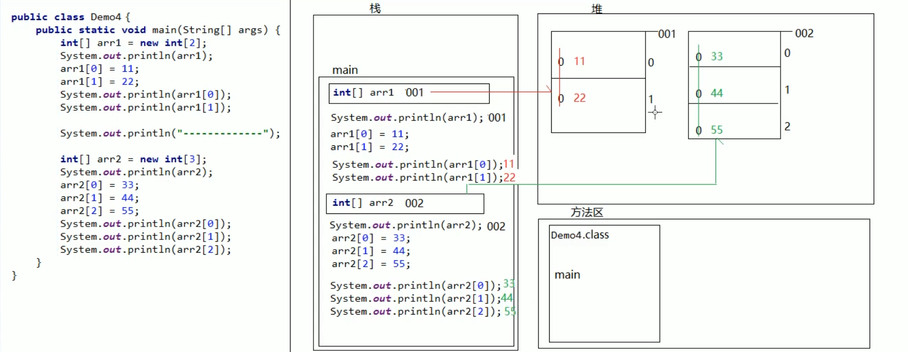

# README

------

## Java初识：

### JavaSE下载与安装：

- 登陆 [oracle](https://www.oracle.com) 官网安装 JavaSE（Java Standard Edition Dev kit）
- MacOS 中 Java 目录

```zsh
# version:
zsxzy@zairesinatras-MBP ~ % java --version
java 11.0.11 2021-04-20 LTS
Java(TM) SE Runtime Environment 18.9 (build 11.0.11+9-LTS-194)
Java HotSpot(TM) 64-Bit Server VM 18.9 (build 11.0.11+9-LTS-194, mixed mode)
```

```zsh
# default JDK path:
/Library/Java/JavaVirtualMachines/jdk-11.0.11.jdk/Contents/Home
```

|  目录   |             说明             |
| :-----: | :--------------------------: |
|   bin   | JDK工具命令、Javac与Java目录 |
|  conf   |       JDK相关配置文件        |
| include |        平台特定头文件        |
|  jmods  |         JDK各类模块          |
|  legal  |           授权文档           |
|   lib   |     JDK工具中的补充JAR包     |

```zsh
# Java
JAVA_HOME="/Library/Java/JavaVirtualMachines/jdk-11.0.11.jdk/Contents/Home"
CLASS_HOME="$JAVA_HOME/lib"
PATH=".$PATH:$JAVA_HOME/bin"
export JAVA_HOME
export CLASSPATH
export PATH
```

```zsh
zsxzy@zairesinatras-MBP ~ % echo $JAVA_HOME
/Library/Java/JavaVirtualMachines/jdk-11.0.11.jdk/Contents/Home
```

- `HelloWorld.java`

```java
public class HelloWorld {
	public static void main(String[] args) {
		System.out.println("HelloWorld");
	}
}
```

```zsh
$ javac HelloWorld.java
$ java HelloWorld
HelloWorld
```

- 文本编辑器

```zsh
# 查看预装 vim 版本
$ vim --version
VIM - Vi IMproved 8.2 (2019 Dec 12)
macOS version
# 查看预装 vim 路径
$ where vim
/usr/bin/vim
```

一般情况下，Mac OS X 自带的 vim 是不能满足需求的，所以选择 [HomeBrew](https://formulae.brew.sh/formula/neovim#default) 安装 [NeoVim](https://neovim.io/)，详情见本项目 README_VIM.md

```zsh
$ brew install neovim
$ nvim # NVIM v0.4.4
```

```zsh
# brew cask 下载目录
cd /usr/local/Caskroom && ls
# brew 下载目录
cd /usr/local/Cellar && ls
```

------

## 语法：

单行注释多行注释与 JavaScript 相同。文档注释： `/**注释信息*/`

关键字：关键字字母全小写且有特殊颜色标记

### 类型转换：

- 隐式转换：取值范围小的数据给取值范围大的类型赋值，可以直接赋值，且系统自动转换。

```java
int a = 10; // int 4 字节
double b = a; // double 8 字节
```

```java
byte => short => int => long => float(即便四个字节,取值范围) => double
				char =>
// 整型
// byte => 1个字节 8位 -128~127
// short => 2个字节 16位
// int => 4个字节 32位
// long => 8个字节 64位
// 浮点型
// float => 4字节 32位
// double => 8字节 64位
```

- 特殊细节：byte 、 short 、 char 三种数据在运算时不论更高数据类型，都会提升为 int 再进行运算

```java
byte z = 6;
byte s = 6;
int zy = z + s;
System.out.println(zy); // 12 (int)
```

- 强制转换：把一个表示数据范围大的数值或者变量赋值给另一个表示数据范围小的变量

```java
格式：目标数据类型 变量名 = （目标数据类型）值或者变量;
```

```java
double num = 6.6;
int numm = (int)num;
System.out.println(numm); // 6 => 直接暴力砍掉小数点后的数值
```

- 转换示例：

```java
public class Test {
	public static void main(String[] args){
		byte a = 3;
		byte b = 4;
		byte c = a + b; // a + b 后会变成默认整型 => (byte)(a+b)
		byte d = 3 + 4; // 常量优化机制
    long f = 1234567898776L // 需要加上L变成long类型
	}
}
```

### 常量：

**定义：**在程序运行过程中，其值不可以发生改变的量：

**分类**（**除空常量外，其他常量均可使用输出语句直接输出**）：

- 字符串常量  用双引号括起来的多个字符（可以包含0个、一个或多个），例如"a"、"zs"、"中国"等


- 整数常量  整数，例如：-10、0、88等


- 小数常量  小数，例如：-5.5、1.0、88.88等


- 字符常量  用单引号括起来的一个字符，例如：'a'、'5'、'B'、'中'等


- 布尔常量  布尔值，表示真假，只有两个值true和false


- 空常量  一个特殊的值，空值，值为null

**注意：**单引号内只能放一个字符：'10'❌、'ab'❌

### 变量：

**定义：**变量就是内存中的存储空间，空间中存储着经常发生改变的数据。本质上，变量是内存中的一块区域，其值可以在范围内变化。

```java
数据类型 变量名 = 数据值
```

#### 存储单元

无论是内存还是硬盘，计算机存储设备的**最小信息单元**叫 **位（bit）**，又称之为 **比特位** ，通常用小写的字母 **b** 表示。而计算机中**最基本的存储单元**叫 **字节（byte）**，通常用大写字母 **B** 表示，**字节是由连续的8个位组成**。

除了字节外还有一些常用的存储单位，其换算单位如下：

1B（字节） = 8bit	1KB = 1024B	1MB = 1024KB	1GB = 1024MB	1TB = 1024GB

#### 数据类型

Java是一个**强类型语言**，数据必须明确数据类型。在Java中的数据类型包括基本数据类型和引用数据类型两种。

Java中的基本数据类型：

| 数据类型 | 关键字       | 内存占用 | 取值范围                     |
| :------- | ------------ | -------- | :--------------------------- |
| 整数     | byte         | 1（8位） | -2^8~2^8-1（-128~127）       |
|          | short        | 2        | -2^15~2^15-1（-32768~32767） |
|          | int(默认)    | 4        | **-2^31~2^31-1**             |
|          | long         | 8        | -2^63~2^63-1                 |
| 浮点     | float        | 4        | 1.401298E-45到3.402823E+38   |
|          | double(默认) | 8        | 4.9000000E-324~1.797693E+308 |
| 字符     | char         | 2        | 0-65535                      |
| 布尔     | boolean      | 1        | true、false                  |

说明：

- e+38 表示是乘以10的38次方，同样，e-45表示乘以10的负45次方。
- 在 Java 中整数默认是 int 类型，浮点数默认是 double 类型。

#### 变量注意事项（理解）

1. 在同一对花括号中，变量名不能重复。
2. 变量在使用之前，必须初始化（赋值）。
3. 定义long类型的变量时，需要在整数的后面加L（大小写均可，建议大写）。因为整数默认是int类型，整数太大可能超出int范围。
4. 定义float类型的变量时，需要在小数的后面加F（大小写均可，建议大写）。因为浮点数的默认类型是double， double的取值范围是大于float的，类型不兼容。

#### 键盘录入（理解）

可以通过 Scanner 类来获取用户的输入。使用步骤如下：

```java
// 导包
import java.util.Scanner;
public class keyboardEntry {
		public static void main(String args[]) {
				// 创建对象
				Scanner sc = new Scanner(System.in);
				// 变量记录录入的数值
				int i = sc.nextInt();
				System.out.println(i);
		}
}
```

#### 标识符（理解）

**定义：**标识符是用户编程时使用的名字，用于给类、方法、变量、常量等命名。

**组成规则：**

- 由字母、数字、下划线“_”、美元符号“$”组成，第一个字符不能是数字。


- 不能使用java中的关键字作为标识符。


- 标识符对大小写敏感（区分大小写）。


**命名约定：**

- 小驼峰式命名：变量名、方法名——首字母小写，从第二个单词开始每个单词的首字母大写。
- 大驼峰式命名：类名——每个单词的首字母都大写。

### 运算符

#### 运算符和表达式（了解）

运算符：对常量或者变量进行操作的符号

表达式：用运算符把常量或者变量连接起来符合语法的式称为表达式。 不同运算符连接的表达式体现的是不同类型的表达式。

#### 算术运算符

~~~java
// 整数操作只能得到整数，要想得到小数，必须有浮点数参与运算
int a = 10;
int b = 3;
System.out.println(a / b); // 输出结果3 => /取结果的商
System.out.println(a % b); // 输出结果1 => %取结果的余数
~~~

#### 字符的 + 操作（理解）

ASCII是计算机 **字节** 到 **字符** 的一套对应关系。

char类型参与算术运算，使用的是计算机底层对应的十进制数值。需要记住三个字符对应的数值：

'a'  --  97		a-z是连续的，所以'b'对应的数值是98，'c'是99，依次递加

'A'  --  65		A-Z是连续的，所以'B'对应的数值是66，'C'是67，依次递加

'0'  --  48		0-9是连续的，所以'1'对应的数值是49，'2'是50，依次递加

~~~java
// 可以通过使用字符与整数做算术运算，得出字符对应的数值是多少
char ch1 = 'a';
System.out.println(ch1 + 1); // 输出98，97 + 1 = 98

char ch2 = 'A';
System.out.println(ch2 + 1); // 输出66，65 + 1 = 66

char ch3 = '0';
System.out.println(ch3 + 1); // 输出49，48 + 1 = 49
~~~

算术表达式中包含不同的基本数据类型的值的时候，整个算术表达式的类型会自动进行提升。

**提升规则：**

- byte、short、char类型将被提升到int类型，不管是否有其他类型参与运算。
- 整个表达式的类型自动提升到与表达式中最高等级的操作数相同的类型
- 等级顺序：byte\short\char --> int --> long --> float --> double

~~~java
byte b1 = 10;
byte b2 = 20;
// byte b3 = b1 + b2; // 该行报错，因为byte类型参与算术运算会自动提示为int，int赋值给byte可能损失精度
int i3 = b1 + b2; // 应该使用int接收
byte b3 = (byte) (b1 + b2); // 或者将结果强制转换为byte类型
-------------------------------
int num1 = 10;
double num2 = 20.0;
double num3 = num1 + num2; // 使用double接收，因为num1会自动提升为double类型
~~~

#### 字符串的“+”操作（理解）

当 + 操作中出现字符串时，表示操作连接符，而不是算术运算：

~~~java
System.out.println("zs"+ 666); // 输出：zs666
~~~

在 + 操作中，如果出现了字符串，就是连接运算符，否则就是算术运算。当连续进行 + 操作时，从左到右逐个执行。

~~~java
System.out.println(1 + 99 + "TEXAS");            // 输出：100TEXAS
System.out.println(1 + 2 + "TEXAS" + 3 + 4);   // 输出：3TEXAS34
// 可以使用小括号改变运算的优先级 
System.out.println(1 + 2 + "TEXAS" + (3 + 4)); // 输出：3TEXAS7
~~~

#### 数值拆分demo

**需求：**键盘录入一个三位数，将其拆分为个位，十位，百位，打印在控制台

```java
import java.util.Scanner;
public class NumericalSplit {
	public static void main(String[] args) {
		// 使用Scanner键盘录入一个三位数
		Scanner sc = new Scanner(System.in);
		System.out.println("请输入一个三位数");
		int num = sc.nextInt();
		// 个位的计算：数值 % 10
		int ge = num % 10;		
		// 十位的计算：数值 / 10 % 10
		int shi = num / 10 % 10;	
		// 百位的计算：数值 / 100
		int bai = num / 100;
		// 将个位, 十位, 百位拼接上正确的字符串, 打印即可
		System.out.println("整数"+num+"个位为:" + ge);
		System.out.println("整数"+num+"十位为:" + shi);
		System.out.println("整数"+num+"百位为:" + bai);
	}
}
```

#### 自增自减运算符（理解）

| 符号 | 作用 | 说明        |
| ---- | ---- | ----------- |
| ++   | 自增 | 变量的值加1 |
| --   | 自减 | 变量的值减1 |

**注意事项：**

- ++和-- 既可以放在变量的后边，也可以放在变量的前边。
- 单独使用的时候， ++和-- 无论前后，结果一样。
- 参与操作时放在变量的后边，先拿变量参与操作，后拿变量做++或者--。
- 参与操作时放在变量的前边，先拿变量做++或者--，后拿变量参与操作。

```java
int i = 10;
i++; // 单独使用
System.out.println("i:" + i); // i:11

int j = 10;
++j; // 单独使用
System.out.println("j:" + j); // j:11

int x = 10;
int y = x++; // 赋值运算，++在后边，所以是使用x原来的值赋值给y，x本身自增1
System.out.println("x:" + x + ", y:" + y); // x:11，y:10

int m = 10;
int n = ++m; // 赋值运算，++在前边，所以是使用m自增后的值赋值给n，m本身自增1
System.out.println("m:" + m + ", m:" + m); // m:11，m:11
```

练习：

```java
int x = 10;
int y = x++ + x++ + x++;
System.out.println(y); // y的值是多少？
/*
解析:三个表达式都是++在后,所以每次使用的都是自增前的值,但程序自左至右执行,所以第一次自增时,使用的是10进行计算,但第二次自增时,x的值已经自增到11了,所以第二次使用的是11,然后再次自增,所以整个式子应该是：int y = 10 + 11 + 12;	输出结果为33。
*/
```

#### 赋值运算符（应用）

赋值运算符的作用是将一个表达式的值赋给左边，左边必须是可修改的，不能是常量。

| 符号 | 作用       | 说明                  |
| ---- | ---------- | --------------------- |
| =    | 赋值       | a=10，将10赋值给变量a |
| +=   | 加后赋值   | a+=b，将a+b的值给a    |
| -=   | 减后赋值   | a-=b，将a-b的值给a    |
| *=   | 乘后赋值   | a*=b，将a×b的值给a    |
| /=   | 除后赋值   | a/=b，将a÷b的商给a    |
| %=   | 取余后赋值 | a%=b，将a÷b的余数给a  |

**注意：**赋值运算符隐含了强制类型转换。

~~~java
short s = 10;
s = s + 10; // 此行代码报错,因为运算中s提升为int类型,运算结果int赋值给short可能损失精度
s += 10; // 此行代码没有问题，隐含了强制类型转换，相当于 s = (short) (s + 10);
~~~

#### 关系运算符（应用）

| 符号 | 说明                                                    |
| ---- | ------------------------------------------------------- |
| ==   | a==b，判断a和b的值是否相等，成立为true，不成立为false   |
| !=   | a!=b，判断a和b的值是否不相等，成立为true，不成立为false |
| >    | a>b，判断a是否大于b，成立为true，不成立为false          |
| >=   | a>=b，判断a是否大于等于b，成立为true，不成立为false     |
| <    | a<b，判断a是否小于b，成立为true，不成立为false          |
| <=   | a<=b，判断a是否小于等于b，成立为true，不成立为false     |

注意事项：

- 关系运算符的结果都是boolean类型，要么是true，要么是false。
- 不要把` == 误写成 =, == `是判断是否相等的关系， = 是赋值。

~~~java
int a = 10;
int b = 20;
// 关系运算的结果肯定是boolean类型，所以也可以将运算结果赋值给boolean类型的变量
boolean flag = a > b;
System.out.println(flag); // 输出false
~~~

#### 逻辑运算符（应用）

逻辑运算符把各个运算的关系表达式连接起来组成一个复杂的逻辑表达式，以判断程序中的表达式是否成立，判断的结果是 true 或 false。

| 符号 | 作用     | 说明                                         |
| ---- | -------- | -------------------------------------------- |
| &    | 逻辑与   | a&b，a和b都是true，结果为true，否则为false   |
| \|   | 逻辑或   | a\|b，a和b都是false，结果为false，否则为true |
| ^    | 逻辑异或 | a^b，a和b结果不同为true，相同为false         |
| !    | 逻辑非   | !a，结果和a的结果正好相反                    |

~~~java
//定义变量
int i = 10;
int j = 20;
int k = 30;

//& “与”，并且的关系，只要表达式中有一个值为false，结果即为false
System.out.println((i > j) & (i > k)); //false & false,输出false
System.out.println((i < j) & (i > k)); //true & false,输出false
System.out.println((i > j) & (i < k)); //false & true,输出false
System.out.println((i < j) & (i < k)); //true & true,输出true
System.out.println("--------");

//| “或”，或者的关系，只要表达式中有一个值为true，结果即为true
System.out.println((i > j) | (i > k)); //false | false,输出false
System.out.println((i < j) | (i > k)); //true | false,输出true
System.out.println((i > j) | (i < k)); //false | true,输出true
System.out.println((i < j) | (i < k)); //true | true,输出true
System.out.println("--------");

//^ “异或”，相同为false，不同为true
System.out.println((i > j) ^ (i > k)); //false ^ false,输出false
System.out.println((i < j) ^ (i > k)); //true ^ false,输出true
System.out.println((i > j) ^ (i < k)); //false ^ true,输出true
System.out.println((i < j) ^ (i < k)); //true ^ true,输出false
System.out.println("--------");

//! “非”，取反
System.out.println((i > j)); //false
System.out.println(!(i > j)); //!false，,输出true
~~~

#### 短路逻辑运算符（理解）

| 符号 | 作用   | 说明                         |
| ---- | ------ | ---------------------------- |
| &&   | 短路与 | 作用和&相同，但是有短路效果  |
| \|\| | 短路或 | 作用和\|相同，但是有短路效果 |

在逻辑与运算中，只要有一个表达式的值为false，那么结果就可以判定为false了，没有必要将所有表达式的值都计算出来，短路与操作就有这样的效果，可以提高效率。同理在逻辑或运算中，一旦发现值为true，右边的表达式将不再参与运算。

- 逻辑与&，无论左边真假，右边都要执行。

- 短路与&&，如果左边为真，右边执行；如果左边为假，右边不执行。

- 逻辑或|，无论左边真假，右边都要执行。

- 短路或||，如果左边为假，右边执行；如果左边为真，右边不执行。

~~~java
int x = 3;
int y = 4;
System.out.println((x++ > 4) & (y++ > 5)); // 两个表达都会运算 false
System.out.println(x); // 4
System.out.println(y); // 5
// ---
System.out.println((x++ > 4) && (y++ > 5)); // 左边已经可以确定结果为false，右边不参与运算
System.out.println(x); // 4
System.out.println(y); // 4
~~~

#### 三元运算符（理解）

~~~java
关系表达式 ? 表达式1 : 表达式2;
~~~

解释：问号前面的位置是判断的条件，判断结果为boolean型，为true时调用表达式1，为false时调用表达式2。其逻辑为：如果条件表达式成立或者满足则执行表达式1，否则执行第二个。

举例：

~~~java
int a = 10;
int b = 20;
int c = a > b ? a : b; // 判断 a>b 是否为真，如果为真取a的值，如果为假，取b的值
~~~

#### 三元运算符demo

**需求：**一座寺庙里住着三个和尚，已知他们的身高分别为150cm、210cm、165cm，请用程序实现获取这三个和尚的最高身高。

~~~java
public class OperatorTest {
	public static void main(String[] args) {
		//1：定义三个变量用于保存和尚的身高，单位为cm，这里仅仅体现数值即可。
		int height1 = 150;
		int height2 = 210;
		int height3 = 165;	
		//2：用三元运算符获取前两个和尚的较高身高值，并用临时身高变量保存起来。
		int tempHeight = height1 > height2 ? height1 : height2;		
		//3：用三元运算符获取临时身高值和第三个和尚身高较高值，并用最大身高变量保存。
		int maxHeight = tempHeight > height3 ? tempHeight : height3;	
		//4：输出结果
		System.out.println("maxHeight:" + maxHeight);
	}
}
~~~

### 流程控制语句

...太简单，略过一些，提几点有意思的：

#### 水仙花数

```java
public class Daffodil {
    public static void main(String[] args) {
		// 输出所有的水仙花数必然要使用到循环,遍历所有的三位数,三位数从100开始,到999结束
		for(int i=100; i<1000; i++) {
			// 在计算之前获取三位数中每个位上的值
			int ge = i%10;
			int shi = i/10%10;
			int bai = i/10/10%10;
			
			// 判定条件是将三位数中的每个数值取出来,计算立方和后与原始数字比较是否相等
			if(ge*ge*ge + shi*shi*shi + bai*bai*bai == i) {
				// 输出满足条件的数字就是水仙花数
				System.out.println(i);
			}
		}
    }
}
```

```java
// 中间有空格、两个换行
public class Daffodil {
	/*
		需求：在控制台输出所有的“水仙花数”，要求每行打印2个

		System.out.print (打印内容);	打印后不换行
		System.out.println(打印内容);	打印后换行

		分析:
			
			1. 定义变量count，用于保存“打印过”的数量，初始值为0
			2. 在判定和打印水仙花数的过程中，拼接空格, 但不换行，并在打印后让count变量+1，记录打印过的数量
			3. 在每一次count变量+1后，判断是否到达了2的倍数，是的话，换行。

	*/
	public static void main(String[] args){
		// 1. 定义变量count，用于保存“打印过”的数量，初始值为0
		int count = 0;
		for(int i = 100; i <= 999; i++){
			int ge = i % 10;
			int shi = i / 10 % 10;
			int bai = i / 10 / 10 % 10;
			
			if(	(ge*ge*ge + shi*shi*shi + bai*bai*bai) == i){
				//  2. 在判定和打印水仙花数的过程中，拼接空格, 但不换行，并在打印后让count变量+1，记录打印过的数量
				System.out.print(i + " ");
				count++;
				// 3. 在每一次count变量+1后，判断是否到达了2的倍数，是的话，换行
				if(count % 2 == 0){
					System.out.println();
				}
			}
		}
	}
}
```

**for循环和while的区别：**

* 条件控制语句所控制的自增变量，因为归属for循环的语法结构中，在for循环结束后，就不能再次被访问到了
* 条件控制语句所控制的自增变量，对于while循环来说不归属其语法结构中，在while循环结束后，该变量还可以继续使用

#### 死循环

```java
// for死循环格式:
for(;;){}

// while死循环格式:
while(true){}

// do..while死循环格式 :
do{}while(true);

// 应用场景
// 键盘录入一个1-100之间的整数,用户就可能会出现一些误操作的现象
```

#### 跳转控制语句

break 跳出循环，结束循环，continue 跳过本次循环，继续下次循环。注意： continue只能在循环中进行使用！

```java
public class elevator {
	/*
		continue: 跳过某次循环体内容的执行
		注意:使用是基于条件控制,在循环内部使用.
		需求:模拟电梯上行的过程 1-24层,4层不停.
	*/
	public static void main(String[] args){
		for(int i = 1; i <= 24; i++){
			if(i == 4){
				continue;
			}
			System.out.println(i + "层到了~");
		}
	}
	
}
```

#### 综合demo

```java
import java.util.Scanner;
public class Test {
	/*
		需求：程序运行后，用户可多次查询星期对应的减肥计划，直到输入0，程序结束	
		步骤:	
			1. 不明确用户操作几次, 使用死循环包裹业务逻辑
			2. 匹配到0的时候，使用break结束循环死循环
	*/
	public static void main (String[] args){
		
		lo:while(true){
			System.out.println("请输入您要查看的星期数:");
			System.out.println("(如无需继续查看,请输入0退出程序)");
			
			// 1. 键盘录入星期数据，使用变量接收
			Scanner sc = new Scanner(System.in);
			int week = sc.nextInt();
			// 2. 多情况判断，采用switch语句实现
			switch(week){
				// 3. 在不同的case中，输出对应的减肥计划
				case 0:
					System.out.println("感谢您的使用");
					break lo;
				case 1:
					System.out.println("跑步");
					break;
				case 2:
					System.out.println("游泳");
					break;
				case 3:
					System.out.println("慢走");
					break;
				case 4:
					System.out.println("动感单车");
					break;
				case 5:
					System.out.println("拳击");
					break;
				case 6:
					System.out.println("爬山");
					break;
				case 7:
					System.out.println("好好吃一顿");
					break;
				default:
					System.out.println("您的输入有误");
					break;
			}
		}		
	}
}
```

**小结：break 和 continue 只能跳出、跳过自己一层关系，若想跳出、跳过指定的一层则加入标号。**

### Random

#### Random产生随机数（掌握）

**概述：**Random类似Scanner，也是Java提供好的API，内部提供了产生随机数的功能。

使用步骤：

- 导入包


```java
import java.util.Random;
```

- 创建对象


```java
Random r = new Random();
```

- 产生随机数


```java
// 10代表的是一个范围,如果括号写10,产生的随机数就是0-9,括号写20,参数的随机数则是0-19
int num = r.nextInt(10);
```

注意：在 JavaScript 中**`Math.random()`**函数返回一个在 0 到小于 1（包括 0，但不包括 1）范围内的浮点伪随机数。若需要参数则必须给定min与max。

```java
import java.util.Random;

public class Demo1Random {
	/*
		Random : 产生随机数
		
		1. 导包	: import java.util.Random;
				    导包的动作必须出现在类定义的上面

		2. 创建对象 : Random r = new Random();
					上面这个格式里面，r 是变量名，可以变，其他的都不允许变

		3. 获取随机数 : int number = r.nextInt(10);	//获取数据的范围：[0,10) 包括0,不包括10
					上面这个格式里面，number是变量名，可以变，数字10可以变。其他的都不允许变
		
		需求: 产生随机数1-10之间的
	*/
	public static void main(String[] args){
		// 2. 创建对象
		Random r = new Random();
		
		for(int i = 1; i <= 10; i++){
			// 3. 获取随机数
			int num = r.nextInt(10) + 1;		// 1-10
			System.out.println(num);
		}
		
		
		
	}
}
```

#### Randomdemo-猜数字（应用）

**需求：**

程序自动生成一个1-100之间的数字，使用程序实现猜出这个数字是多少？

当猜错的时候根据不同情况给出相应的提示

A. 如果猜的数字比真实数字大，提示你猜的数据大了

B. 如果猜的数字比真实数字小，提示你猜的数据小了

C. 如果猜的数字与真实数字相等，提示恭喜你猜中了

```java
import java.util.Scanner;
import java.util.Random;

public class GuessMe {
	/*
		需求：程序自动生成一个1-100之间的数字，使用程序实现猜出这个数字是多少？
			当猜错的时候根据不同情况给出相应的提示
			如果猜的数字比真实数字大，提示你猜的数据大了
			如果猜的数字比真实数字小，提示你猜的数据小了
			如果猜的数字与真实数字相等，提示恭喜你猜中了
		
		1. 准备Random和Scanner对象, 分别用于产生随机数和键盘录入
		2. 使用Random产生一个1-100之间的数, 作为要猜的数
		3. 键盘录入用户猜的的数据
		4. 使用录入的数据(用户猜的数据)和随机数(要猜的数据)进行比较, 并给出提示
		5. 以上内容需要多次进行, 但无法预估用户输入几次可以猜测正确, 使用while(true)死循环包裹
		6. 猜对之后, break结束.

	*/
	public static void main(String[] args){
		// 1. 准备Random和Scanner对象, 分别用于产生随机数和键盘录入
		Random r = new Random();
		Scanner sc = new Scanner(System.in);
		// 2. 使用Random产生一个1-100之间的数, 作为要猜的数
		int randomNum = r.nextInt(100) + 1;
		// 5. 以上内容需要多次进行, 但无法预估用户输入几次可以猜测正确, 使用while(true)死循环包裹
		while(true){
			// 3. 键盘录入用户猜的的数据
			System.out.println("请输入您猜的数据:");
			int num = sc.nextInt();
			// 4. 使用录入的数据(用户猜的数据)和随机数(要猜的数据)进行比较, 并给出提示
			if(num > randomNum){
				System.out.println("猜大了");
			}else if(num < randomNum){
				System.out.println("猜小了");
			}else{
				// 6. 猜对之后, break结束.
				System.out.println("恭喜,猜中了");
				break;
			}
		}
		System.out.println("感谢您的使用");
	}
}
```

### 数组

数组就是存储数据的容器，存储多个数据需数据类型要一致。 

#### 数组的定义格式

```java
// 数据类型[] 数组名
int[] arr;        
double[] arr;      
char[] arr;
```

```java
// 数据类型 数组名[]
int arr[];
double arr[];
char arr[];
```

#### 数组的动态初始化

只给定数组的长度，由系统给出默认初始化值

```java
// 数据类型[] 数组名 = new 数据类型[数组长度];
int[] arr = new int[3];
```

```java
public class ArrayBasic {
		public static void main (String[] args) {
      // 数据类型[] 数组名 = new 数据类型[数组的长度];
			int[] arr = new int[5];
      // 打印数组变量的时候, 会打印出数组的内存地址
			System.out.println(arr); // [I@6504e3b2
      // @: 分隔符
      // [: 当前的空间是一个数组类型
      // I: 当前数组容器中所存储的数据类型
      // 6504e3b2: 十六进制内存地址
		}
}
```

#### 数组元素访问

**索引：**每一个存储到数组的元素，都会自动的拥有一个编号，从0开始。这个自动编号称为数组索引(index)，可以通过数组的索引访问到数组中的元素。 	

```java
数组名[索引];
```

```java
public class ArrayBasic {
		public static void main (String[] args) {
				// 数据类型[] 数组名 = new 数据类型[数组的长度];
				int[] arr = new int[5];
				// 打印数组变量的时候, 会打印出数组的内存地址
				System.out.println(arr); // [I@6504e3b2
				// @: 分隔符
				// [: 当前的空间是一个数组类型
				// I: 当前数组容器中所存储的数据类型
				// 6504e3b2: 十六进制内存地址

				// 数组名[索引]  访问数组容器中的空间位置
				// 0  系统自动分配的默认初始化值 => 数组在创建完毕后, 即使没有赋值, 元素也可以取出, 但取出的元素都是默认初始化值.
				System.out.print(arr[0] + " "); // 0 
				System.out.print(arr[1] + " "); // 0
				System.out.print(arr[2] + " "); // 0

				System.out.print(" -------------- ");

				// 数组名[索引]
				arr[0] = 1;
				arr[1] = 2;
				arr[2] = 3;

				System.out.print(arr[0]); // 1
				System.out.print(arr[1]); // 2
				System.out.print(arr[2]); // 3
		}
}
```

#### 内存分配

- 内存是计算机中的重要原件，临时存储区域，作用是运行程序。
- 我们编写的程序是存放在硬盘中的，在硬盘中的程序是不会运行的。
- 必须放进内存中才能运行，运行完毕后会清空内存。 
- Java虚拟机要运行程序，必须要对内存进行空间的分配和管理。 

| 区域名称   | 作用                                                         |
| ---------- | ------------------------------------------------------------ |
| 寄存器     | 给CPU使用，和我们开发无关。                                  |
| 本地方法栈 | JVM在使用操作系统功能的时候使用，和我们开发无关。            |
| **方法区** | 存储可以运行的 `.class` 文件。                               |
| **堆内存** | 存储对象或者数组，new来创建的都存储在堆内存且存在地址值。    |
| **栈内存** | 方法运行时使用的内存，比如main方法运行，进入方法栈中执行；局部变量。 |


| 数据类型     | 默认值 |
| ------------ | ------ |
| 整数         | 0      |
| 浮点数       | 0.0    |
| 布尔         | false  |
| 字符         | 空字符 |
| 引用数据类型 | null   |

引用数据类型：引用、记录地址值的变量，所对应的数据类型。




#### 数组的静态初始化

在创建数组时，直接将元素确定，系统自动计算该数组长度。

```java
// 完整版
数据类型[] 数组名 = new 数据类型[]{元素1,元素2,...};
```

```java
// 简化版
数据类型[] 数组名 = {元素1,元素2,...};
```

```java
public class ArrayBasic {
		public static void main (String[] args) {
				// 数据类型[] 数组名 = new 数据类型[数组的长度];
				int[] arr = new int[5];
				// 打印数组变量的时候, 会打印出数组的内存地址
				System.out.println(arr); // [I@6504e3b2
				// @: 分隔符
				// [: 当前的空间是一个数组类型
				// I: 当前数组容器中所存储的数据类型
				// 6504e3b2: 十六进制内存地址

				// 数组名[索引]  访问数组容器中的空间位置
				// 0  系统自动分配的默认初始化值 => 数组在创建完毕后, 即使没有赋值, 元素也可以取出, 但取出的元素都是默认初始化值.
				System.out.print(arr[0] + " "); // 0 
				System.out.print(arr[1] + " "); // 0
				System.out.print(arr[2] + " "); // 0

				System.out.print(" -------------- ");

				// 数组名[索引]
				arr[0] = 1;
				arr[1] = 2;
				arr[2] = 3;

				System.out.print(arr[0]); // 1
				System.out.print(arr[1]); // 2
				System.out.println(arr[2]); // 3

				// static array
				// 数据类型[] 数组名 = new 数据类型[]{数据1,数据2,数据3...};
				int[] arrr = new int[]{111,222,333};
				System.out.print("-" + arrr[0]);
				System.out.print("-" + arrr[1]);
				System.out.print("-" + arrr[2]);

				// 数据类型[] 数组名 = {数据1,数据2,数据3...};
				// 编译器会自动补上代码;
				int[] arr2 = {444,555,666};
				System.out.print("-" + arr2);
				System.out.print("-" + arr2[0]);
				System.out.print("-" + arr2[1]);
				System.out.print("-" + arr2[2]);
		}
}
```

#### 初始化的差异

- 动态初始化：明确个数，不明确具体数值
- 静态初始化：需求已明确需要操作的具体数据

#### 数组操作的两个常见问题

- 索引越界：访问不存在的索引

```java
public class ArrayErr {
    public static void main(String[] args) {
        int[] arr = new int[3];
      	// 访问 3 的索引 ❌
        System.out.println(arr[3]);
    }
}
// 抛出 `ArrayIndexOutOfBoundsException` 数组越界异常
// 解决: 将错误的索引修改为正确的索引范围
```

- 空指针异常：

```java
public class ArrayDemo {
    public static void main(String[] args) {
        int[] arr = new int[3];
        // 把null赋值给数组意味着变量arr将不会在保存数组的内存地址, 也就不允许再操作数组
        arr = null; // 空值-不再记录内存地址
        System.out.println(arr[0]);
    }
}
// 抛出 NullPointerException 空指针异常
// 解决: 给数组真正的堆内存空间引用
```

#### 数组遍历

将数组中的每个元素分别获取；也是数组操作中的基石。

```java
public class ArrayIte {
    public static void main(String[] args) {
        //定义数组
        int[] arr = {1, 2, 3, 4, 5};

        //使用通用的遍历格式
        for(int x=0; x<arr.length; x++) {
            System.out.println(arr[x]);
        }
    }
}
```

#### 数组元素求和

需求：键盘录入5个整数，存储到数组中，并对数组求和

```java
import java.util.Scanner;
public class AddArrayItem {
    /*
        需求：键盘录入5个整数,存储到数组中,并对数组求和
        思路：
            1.创建键盘录入对象,准备键盘录入
            2.定义一个求和变量,准备记录累加后的结果
            3.动态初始化一个长度为5的int数组,准备存储键盘录入的数值
            4.将键盘录入的数值存储到数组中
            5.遍历数组,取出每一个元素,并求和
            6.输出总和
     */
    public static void main(String[] args) {
        // 1.创建键盘录入对象,准备键盘录入
        Scanner sc = new Scanner(System.in);
        // 2.定义一个求和变量,准备记录累加后的结果
        int sum = 0;
        // 3.动态初始化一个长度为5的int数组,准备存储键盘录入的数值
        int[] arr = new int[5];
        // 4.将键盘录入的数值存储到数组中
        for(int i = 0; i < arr.length; i++){
            System.out.println("请输入第" + (i+1) + "个整数:");
            //arr[i] = 10;
            arr[i] = sc.nextInt();
        }
        // 5.遍历数组,取出每一个元素,并求和
        for (int i = 0; i < arr.length; i++) {
            sum += arr[i];
        }
        // 6.输出总和
        System.out.println("sum:" + sum);
    }
}

```

#### 数组基本查找

**需求：**数组 arr = {1, 2, 3, 4, 5}; 键盘录入一个数据，查找该数据在数组中的索引，并在控制台输出找到的索引值。

**思路：**

- 定义一个数组，用静态初始化完成数组元素的初始化
- 键盘录入要查找的数据，用一个变量接收
- 定义一个索引变量，初始值为-1
- 遍历数组，获取到数组中的每一个元素
- 拿键盘录入的数据和数组中的每一个元素进行比较，如果值相同，就把该值对应的索引赋值给索引变量，并结束循环
- 输出索引变量

```java
import java.util.Scanner;
public class GetIndexInArr {
		public static void main (String[] args) {
				int[] arr = {1, 2, 3, 4, 5};
				// 用变量接收键盘录入要查找的数据
				Scanner sc = new Scanner(System.in);
				System.out.println("请输入需要查看索引的元素:"); // 需要在int num之前否则开始不会显示
				int num = sc.nextInt(), index = -1;
				for(int i = 0; i < arr.length; i++){
						if(num == arr[i]) {
								index = i;
								break; // 提高效率
						}
				}
				System.out.println(index);
		}
}
```

#### 评委打分demo

**需求：**在编程竞赛中，有6个评委为参赛的选手打分，分数为0-100的整数分。选手的最后得分为：去掉一个最高分和一个最低分后 的4个评委平均值 (不考虑小数部分)。

```java
    public static void main(String[] args) {
        // 1.定义一个数组,用动态初始化完成数组元素的初始化,长度为6
        int[] arr = new int[6];
        // 2.键盘录入评委分数
        Scanner sc = new Scanner(System.in);
        //  3.由于是6个评委打分所以接收评委分数的操作用循环
        for (int i = 0; i < arr.length; i++) {
            System.out.println("请输入第" + (i+1) + "个评委的打分:");
            int score = sc.nextInt();
            if(score >= 0 && score <= 100){
                // 合法的分值
                arr[i] = score;
            }else{
                // 非法的分值
                System.out.println("您的打分输入有误,请检查是否是0-100之间");
                i--;
            }
        }
        // 4.求出数组最大值
        int max = arr[0];
        for (int i = 1; i < arr.length; i++) {
            if(max < arr[i]){
                max = arr[i];
            }
        }
        // 5.求出数组最小值
        int min = arr[0];
        for (int i = 1; i < arr.length; i++) {
            if(min > arr[i]){
                min = arr[i];
            }
        }
        // 6.求出数组总和
        int sum = 0;
        for (int i = 0; i < arr.length; i++) {
            sum += arr[i];
        }
        // 7.按照计算规则进行计算得到平均分
        int avg = (sum - max - min ) / 4;
        // 8.输出平均分
        System.out.println(avg);
    }
}
```


### 方法概述

方法（method）是将具有独立功能的代码块组织成整体，使其具有特殊功能的代码集。不调用不执行。

**注意：**

- 先创建才可以使用，该过程成为**方法定义**
- 创建后并不可以运行，需要手动使用后才执行，该过程成为**方法调用**

#### 定义和调用

无参数方法定义：

```java
public static void 方法名 () {
	// 方法体;
}
```

调用格式：

```java
方法名(); // 注意:方法必须先定义后调用,否则程序将报错
```

#### 调用过程

在没有被调用时，**方法都在方法区的字节码文件（`.class`）中存储**。每个方法在被调用执行的时候，会**进入栈内存**，并且拥有独立的内存空间，方法内部代码**调用完毕之后**，**会从栈内存中弹栈消失**。

栈内存好比弹夹，最先压入，最后输出。同理，最先压入的方法最后输出。

#### 带参数方法的定义和调用

在小括号定义变量的方法就是带参数方法。

参数：由数据类型和变量名组成 => 数据类型 变量名

```java
// 定义
// 方法定义时,参数中的数据类型与变量名都不能缺少,缺少任意一个程序将报错
public static void 方法名 (参数 | 数据类型 变量名) {
	// 方法体;
}
// 方法定义时，多个参数之间使用逗号( ，)分隔
public static void 方法名 (参数1, 参数2, 参数3...) {
	// 方法体;
}
```

```java
// 调用
方法名(参数);
// 方法调用时,参数的数量与类型必须与方法定义中的设置相匹配,否则程序将报错
方法名(参数1,参数2); 
```

#### 形参和实参

- **形参：**方法**定义**中的参数：等同于变量定义格式（因为如果没有调用则不一定接收到数据）。
- **实参：**方法**调用**中的真实参数：等同于使用变量或常量。

#### 带返回值方法定义和调用（掌握）

定义格式：

```java
public static 数据类型 方法名 ( 数据类型 参数名 ) {
  // 方法体;
  // 返回值与方法定义上的数据类型要匹配
	return 数据 ;
}
// public static => 修饰符,目前先记住这个格式
// 数据类型 => 方法操作完毕之后返回的数据的数据类型;如果方法操作完毕，没有数据返回，这里写void，而且方法体中一般不写return
// 方法名 => 调用方法时候使用的标识
// 参数	=> 由数据类型和变量名组成，多个参数之间用逗号隔开
// 方法体 =>	完成功能的代码块
// return	=> 如果方法操作完毕，有数据返回，用于把数据返回给调用者
```

调用格式：

```java
方法名 ( 参数 ) ; // 没有接收
数据类型 变量名 = 方法名 ( 参数 ) ; // 通过变量名接收了返回值
// 注意:方法的返回值通常会使用变量接收,否则该返回值将无意义
```

注意：

- void类型的方法，直接调用即可，方法中也可以有 `return;` 表示直接结束。
- 非void类型的方法，推荐用变量接收调用
- 方法不能嵌套定义

### 方法重载

同一个类中如果出现方法名相同，参数完全相同，称为方法的重复定义，是一种冲突性的错误；如果仅是方法名相同，参数不同则不会，允许存在。

**同一个类中定义多个同名方法，每个方法具有不同的参数类型、顺序或参数个数。这些同名方法构成重载关系，与返回值无关。**

简而言之，即满足下列条件的多个方法相互构成重载：

* 多个方法在同一个类中
* 多个方法具有相同的方法名
* 多个方法的参数不相同，类型不同或者数量不同

注意：

* 重载仅对应方法的定义，与方法的调用无关，调用方式参照标准格式
* 重载仅针对同一个类中方法的名称与参数进行识别，与返回值无关，换句话说不能通过返回值来判定两个方法是否相互构成重载

#### 方法重载demo

需求：使用方法重载的思想，设计比较两个整数是否相同的方法，兼容全整数类型（byte,short,int,long） 

思路：

​	① 定义比较两个数字的是否相同的方法compare()方法，参数选择两个int型参数

​	② 定义对应的重载方法，变更对应的参数类型，参数变更为两个long型参数

​	③ 定义所有的重载方法，两个byte类型与两个short类型参数 

​	④ 完成方法的调用，测试运行结果 

```java
public class MethodReload {
    public static void main(String[] args) {
        //调用方法
        System.out.println(compare(10, 20));
        System.out.println(compare((byte) 10, (byte) 20));
        System.out.println(compare((short) 10, (short) 20));
        System.out.println(compare(10L, 20L));
    }

    //int
    public static boolean compare(int a, int b) {
        System.out.println("int");
        return a == b;
    }

    //byte
    public static boolean compare(byte a, byte b) {
        System.out.println("byte");
        return a == b;
    }

    //short
    public static boolean compare(short a, short b) {
        System.out.println("short");
        return a == b;
    }

    //long
    public static boolean compare(long a, long b) {
        System.out.println("long");
        return a == b;
    }

}
```

#### 方法的参数传递基本类型

```java
public class Test1 {
    public static void main(String[] args) {
        int number = 100;
        System.out.println("调用change方法前:" + number);
        change(number);
        System.out.println("调用change方法后:" + number);
    }
		// 不同方法不同变量,仅恰巧名字一样而已
  	// 传过来的是变量的具体数据
    public static void change(int number) {
        number = 200;
    }
}
```

**结论：**基本数据类型的参数，形式参数的改变，不影响实际参数（每个方法在栈内存中，都会有独立的栈空间，方法运行结束后就会**弹栈消失**）。


#### 方法参数传递引用类型

```java
public class Test2 {
    /*
		方法参数传递为引用数据类型:传入方法中的, 是内存地址.
    */
    public static void main(String[] args) {
        int[] arr = {10, 20, 30};
        System.out.println("调用change方法前:" + arr[1]);
        change(arr);
        System.out.println("调用change方法后:" + arr[1]);
    }
    public static void change(int[] arr) {
        arr[1] = 200;
    }
}
```

**结论：**对于引用类型的参数，形式参数的改变，影响实际参数的值（引用数据类型的传参，传入的是地址值，内存中会造成两个引用指向同一个内存的效果，所以即使方法弹栈，堆内存中的数据也已经是改变后的结果 ）。


#### 数组遍历demo

需求：设计一个方法用于数组遍历，要求遍历的结果是在一行上的。例如：[11, 22, 33, 44, 55] 

```java
public class Test1 {
    public static void main(String[] args) {
        // 静态初始化数组元素
        int[] arr = {11, 22, 33, 44, 55};
        // 调用遍历方法
        printArray(arr);
    }
    public static void printArray(int[] arr){
        System.out.print("[");
        for (int i = 0; i < arr.length; i++) {
            if(i == arr.length -1){
                System.out.println(arr[i] + "]");
            }else{
                System.out.print(arr[i] + ", ");
            }
        }
    }
}

```

#### 方法同时获取数组最大值和最小值

- 需求：设计一个方法，该方法能够同时获取数组的最大值，和最小值
- 注意： `return` 语句，只能带回一个结果

```java
public class GetMinMax {
    // 注意: return语句, 只能带回一个结果.
    public static void main(String[] args) {
        int[] arr = {11,55,33,22,44};
        int[] maxAndMin = getMaxAndMin(arr);
        System.out.println(maxAndMin[0]);
        System.out.println(maxAndMin[1]);
    }
    public static int[] getMaxAndMin(int[] arr){
        int max = arr[0];
        for (int i = 1; i < arr.length; i++) {
            if(max < arr[i]){
                max = arr[i];
            }
        }

        int min = arr[0];
        for (int i = 1; i < arr.length; i++) {
            if(min > arr[i]){
                min = arr[i];
            }
        }

        int[] maxAndMin = {min, max};

        return maxAndMin;
    }
}
```

### Debug模式

断点调是用于查看程序的执行流程的调试工具，表示从标记的地方开始查看与追踪。

Debug介绍与操作流程：

- 加断点：选择要设置断点的代码行，在行号的区域后面单击鼠标左键
- 运行加断点的程序：在代码区域右键 Debug 执行

- 查看：Debugger 窗口、Console 窗口

- 点击：Step Into 箭头，也可以直接按 F7

- 删除断点：选择要删除的断点，单击鼠标左键即可


### 进制的介绍与书写格式

```java
public class Demo1 {
    /*
        十进制：Java中，数值默认都是10进制，不需要加任何修饰。
        二进制：数值前面以0b开头，b大小写都可以。
        八进制：数值前面以0开头。
        十六进制：数值前面以0x开头，x大小写都可以。

        注意: 书写的时候, 虽然加入了进制的标识, 但打印在控制台展示的都是十进制数据.
     */
    public static void main(String[] args) {
        System.out.println(10);
        System.out.println("二进制数据0b10的十进制表示为:" + 0b10);
        System.out.println("八进制数据010的十进制表示为:" + 010);
        System.out.println("十六进制数据0x10的十进制表示为:" + 0x10);
    }
}
```

### 2.2 任意进制到十进制的转换

### 2.3 进制转换-十进制到任意进制转换

​	**2.3.1 : 十进制到二进制的转换**

​	公式：除基取余使用源数据，不断的除以基数（几进制，基数就是几）得到余数，直到商为0，再将余数倒着拼起来即可。

​	需求：将十进制数字11，转换为2进制。

​	实现方式：源数据为11，使用11不断的除以基数，也就是2，直到商为0。

​	**2.3.2 : 十进制到十六进制的转换**

​	公式：除基取余使用源数据，不断的除以基数（几进制，基数就是几）得到余数，直到商为0，再将余数倒着拼起来即可。

​	需求：将十进制数字60，转换为16进制。

​	实现方式：源数据为60，使用60不断的除以基数，也就是16，直到商为0。

​	结论：十进制到任意进制的转换

​	公式：除基取余使用源数据，不断的除以基数（几进制，基数就是几）得到余数，直到商为0，再将余数倒着	拼起来即可

### 2.4  快速进制转换法

​	8421码：

​	8421码又称BCD码，是BCD代码中最常用的一种BCD： (Binary-Coded Decimal‎) 二进制码十进制数在这种编码方式中，每一位二进制值的1都是代表一个固定数值，把每一位的1代表的十进制数加起来得到的结果就是它所代表的十进制数。

### 2.5  原码反码补码

前言 : 计算机中的数据，都是以二进制补码的形式在运算，而补码则是通过反码和原码推算出来的

**原码 **:（可直观看出数据大小）

就是二进制定点表示法，即最高位为符号位，【0】表示正，【1】表示负，其余位表示数值的大小。

通过一个字节表示+7和-7，代码：byte b1 = 7;   byte b2 = -7;一个字节等于8个比特位，也就是8个二进制位	

0(符号位)	0000111 	

1(符号位)	0000111

**反码 :** 正数的反码与其原码相同；负数的反码是对其原码逐位取反，但符号位除外。

**补码 :** （数据以该状态进行运算）正数的补码与其原码相同；负数的补码是在其反码的末位加1。

### 2.6 位运算-基本位运算符

```java
package com.itheima.demo;

public class Demo2 {
    /*
        位运算:

            位运算符指的是二进制位的运算，先将十进制数转成二进制后再进行运算。
            在二进制位运算中，1表示true，0表示false。

             & 位与 : 遇false则false, 遇0则0

                        00000000 00000000 00000000 00000110     // 6的二进制
                     &  00000000 00000000 00000000 00000010     // 2的二进制
                    -----------------------------------------
                        00000000 00000000 00000000 00000010     // 结果: 2

             | 位或 : 遇true则true, 遇1则1

             ^ 位异或 : 相同为false, 不同为true

             ~ 取反 : 全部取反, 0变1, 1变0  (也包括符号位)

                    00000000 00000000 00000000 00000110         // 6的二进制补码
                  ~ 11111111 11111111 11111111 11111001

                  -                                   1         // -1求反码
                   ------------------------------------
                    11111111 11111111 11111111 11111000         // 反码推原码

                    10000000 00000000 00000000 00000111         // -7
     */
    public static void main(String[] args) {
        System.out.println(6 & 2);
        System.out.println(~6);
    }
}

```


### 2.7 位运算-位移运算符

**位运算概述 :**  位运算符指的是二进制位的运算，先将十进制数转成二进制后再进行运算。在二进制位运算中，1表示true，0表示false。

**位运算符介绍 :** 

**代码 :** 

```java
package com.itheima.demo;

public class Demo3 {
    /*
       位移运算符:

               << 有符号左移运算，二进制位向左移动, 左边符号位丢弃, 右边补齐0
                        运算规律: 向左移动几位, 就是乘以2的几次幂

                                12 << 2

                                (0)0000000 00000000 00000000 000011000  // 12的二进制

       -----------------------------------------------------------------------------
               >> 有符号右移运算，二进制位向右移动, 使用符号位进行补位
                        运算规律: 向右移动几位, 就是除以2的几次幂

                                000000000 00000000 00000000 0000001(1)  // 3的二进制

       -----------------------------------------------------------------------------

                >>> 无符号右移运算符,  无论符号位是0还是1，都补0

                                010000000 00000000 00000000 00000110  // -6的二进制

     */
    public static void main(String[] args) {
        System.out.println(12 << 1);  // 24
        System.out.println(12 << 2);  // 48

    }
}

```

```java
package com.itheima.demo;

public class Demo4 {
    /*
        ^ 运算符的特点

                一个数, 被另外一个数, 异或两次, 该数本身不变
     */
    public static void main(String[] args) {
        System.out.println(10 ^ 5 ^ 10);
    }
}

```

## 3.基础练习

### 3.1 数据交换

**案例需求**

​	已知两个整数变量a = 10，b = 20，使用程序实现这两个变量的数据交换
​        最终输出a = 20，b = 10;

**代码实现**

```java
package com.itheima.test;

public class Test1 {
    /*
        需求：已知两个整数变量a = 10，b = 20，使用程序实现这两个变量的数据交换
        最终输出a = 20，b = 10;


        思路：
        1. 定义一个三方变量temp，将a原本记录的值，交给temp记录 （a的值，不会丢了）
        2. 使用 a 变量记录 b 的值，（第一步交换完毕，b的值也丢不了了）
        3. 使用 b 变量记录 temp的值，也就是a原本的值 （交换完毕）
        4. 输出 a 和 b 变量即可
     */
    /*
        动态初始化格式：

            数据类型[][] 变量名 = new 数据类型[m][n];
            m表示这个二维数组，可以存放多少个一维数组
            n表示每一个一维数组，可以存放多少个元素
     */
    public static void main(String[] args) {
        int a = 10;
        int b = 20;

        // 将a原本记录的值，交给temp记录 （a的值，不会丢了）
        int temp = a;
        // 用 a 变量记录 b 的值，（第一步交换完毕，b的值也丢不了了）
        a = b;
        // 使用 b 变量记录 temp的值，也就是a原本的值 （交换完毕）
        b = temp;

        // 输出 a 和 b 变量即可
        System.out.println("a=" + a);
        System.out.println("b=" + b);
    }
}
```

### 3.2 数组反转【应用】

**案例需求 :** 

​	已知一个数组 arr = {19, 28, 37, 46, 50}; 用程序实现把数组中的元素值交换，

​	交换后的数组 arr = {50, 46, 37, 28, 19}; 并在控制台输出交换后的数组元素

**实现步骤 :** 

 	1. 定义两个变量, start和end来表示开始和结束的指针.          

2. 确定交换条件, start < end 允许交换          
3. 循环中编写交换逻辑代码         
4. 每一次交换完成, 改变两个指针所指向的索引 start++, end--          
5. 循环结束后, 遍历数组并打印, 查看反转后的数组

**代码实现 :** 

```java
package com.itheima.test;

public class Test2 {
    /*
        需求：已知一个数组 arr = {19, 28, 37, 46, 50}; 用程序实现把数组中的元素值交换，
          交换后的数组 arr = {50, 46, 37, 28, 19}; 并在控制台输出交换后的数组元素。

        步骤:
              1. 定义两个变量, start和end来表示开始和结束的指针.
              2. 确定交换条件, start < end 允许交换
              3. 循环中编写交换逻辑代码
              4. 每一次交换完成, 改变两个指针所指向的索引 start++, end--
              5. 循环结束后, 遍历数组并打印, 查看反转后的数组
     */
    public static void main(String[] args) {
        int[] arr = {19, 28, 37, 46, 50};
        //  1. 定义两个变量, start和end来表示开始和结束的指针.
        int start = 0;
        int end = arr.length -1;
        //  2. 确定交换条件, start < end 允许交换
        // 4. 每一次交换完成, 改变两个指针所指向的索引 start++, end--
        // for(int start = 0, end = arr.length -1; start < end; start++, end--)
        for( ; start < end; start++, end--){
            // 3. 循环中编写交换逻辑代码
            int temp = arr[start];
            arr[start] = arr[end];
            arr[end] = temp;
        }

        for (int i = 0; i < arr.length; i++) {
            System.out.println(arr[i]);
        }
    }
}

```

### 3.3 二维数组概述

​	**概述 :**  二维数组也是一种容器，不同于一维数组，该容器存储的都是一维数组容器

### 3.4 二维数组动态初始化

```java
动态初始化格式：

数据类型[][] 变量名 = new 数据类型[m][n];
m表示这个二维数组，可以存放多少个一维数组
n表示每一个一维数组，可以存放多少个元素
```

```java
package com.itheima.demo;

public class Demo1Array {
    /*
        动态初始化格式：

            数据类型[][] 变量名 = new 数据类型[m][n];
            m表示这个二维数组，可以存放多少个一维数组
            n表示每一个一维数组，可以存放多少个元素
     */
    public static void main(String[] args) {
        // 数据类型[][] 变量名 = new 数据类型[m][n];
        int[][] arr = new int[3][3];
        /*
            [[I@10f87f48

            @ : 分隔符
            10f87f48 : 十六进制内存地址
            I : 数组中存储的数据类型
            [[ : 几个中括号就代表的是几维数组
         */
        System.out.println(arr);

        /*
            二维数组存储一维数组的时候, 存储的是一维数组的内存地址
         */
        System.out.println(arr[0]);
        System.out.println(arr[1]);
        System.out.println(arr[2]);

        System.out.println(arr[0][0]);
        System.out.println(arr[1][1]);
        System.out.println(arr[2][2]);

        // 向二维数组中存储元素
        arr[0][0] = 11;
        arr[0][1] = 22;
        arr[0][2] = 33;

        arr[1][0] = 11;
        arr[1][1] = 22;
        arr[1][2] = 33;

        arr[2][0] = 11;
        arr[2][1] = 22;
        arr[2][2] = 33;

        // 从二维数组中取出元素并打印
        System.out.println(arr[0][0]);
        System.out.println(arr[0][1]);
        System.out.println(arr[0][2]);
        System.out.println(arr[1][0]);
        System.out.println(arr[1][1]);
        System.out.println(arr[1][2]);
        System.out.println(arr[2][0]);
        System.out.println(arr[2][1]);
        System.out.println(arr[2][2]);
    }
}
```

### 3.5  二维数组访问元素的细节问题

问题 :  二维数组中存储的是一维数组, 那能不能存入 [提前创建好的一维数组] 呢 ?

答 : 可以的

#### 代码实现

```java
package com.itheima.demo;

public class Demo2Array {
    /*
        问题: 二维数组中存储的是一维数组, 那能不能存入 [提前创建好的一维数组] 呢 ?
        答 : 可以的
     */
    public static void main(String[] args) {
        int[] arr1 = {11,22,33};
        int[] arr2 = {44,55,66};
        int[] arr3 = {77,88,99,100};

        int[][] arr = new int[3][3];

        arr[2][3] = 100;

        arr[0] = arr1;
        arr[1] = arr2;
        arr[2] = arr3;

        System.out.println(arr[1][2]);
        System.out.println(arr[2][3]);
    }
}
```

### 3.6 二维数组静态初始化

 	**完整格式 :** 数据类型[][] 变量名 = new 数据类型[][]{ {元素1, 元素2...} , {元素1, 元素2...} 
 	
 	**简化格式 :**  数据类型[][] 变量名 = { {元素1, 元素2...} , {元素1, 元素2...} ...};

**代码实现 : **

```java
package com.itheima.demo;

public class Demo3Array {
    /*
        完整格式：数据类型[][] 变量名 = new 数据类型[][]{ {元素1, 元素2...} , {元素1, 元素2...} ...};

        简化格式: 数据类型[][] 变量名 = { {元素1, 元素2...} , {元素1, 元素2...} ...};
     */
    public static void main(String[] args) {
        int[] arr1 = {11,22,33};
        int[] arr2 = {44,55,66};

        int[][] arr = {{11,22,33}, {44,55,66}};
        System.out.println(arr[0][2]);

        int[][] array = {arr1,arr2};
        System.out.println(array[0][2]);
    }
}

```

### 3.7 二维数组遍历

**需求 :**   

​	已知一个二维数组 arr = {{11, 22, 33}, {33, 44, 55}};

​	遍历该数组，取出所有元素并打印

**步骤 :** 

 	1. 遍历二维数组，取出里面每一个一维数组
 	2. 在遍历的过程中，对每一个一维数组继续完成遍历，获取内部存储的每一个元素

**代码实现 :** 

```java
package com.itheima.test;

public class Test1 {
    /*
        需求:

            已知一个二维数组 arr = {{11, 22, 33}, {33, 44, 55}};
            遍历该数组，取出所有元素并打印

        步骤:
            1. 遍历二维数组，取出里面每一个一维数组
            2. 在遍历的过程中，对每一个一维数组继续完成遍历，获取内部存储的每一个元素
     */
    public static void main(String[] args) {
        int[][] arr = {{11, 22, 33}, {33, 44, 55}};

        // 1. 遍历二维数组，取出里面每一个一维数组
        for (int i = 0; i < arr.length; i++) {
            //System.out.println(arr[i]);
            // 2. 在遍历的过程中，对每一个一维数组继续完成遍历，获取内部存储的每一个元素
            //int[] temp = arr[i];
            for (int j = 0; j < arr[i].length; j++) {
                System.out.println(arr[i][j]);
            }
        }
    }
}
```

### 3.8 二维数组求和

**需求 :**

 	某公司季度和月份统计的数据如下：单位(万元)
 	第一季度：22,66,44
 	第二季度：77,33,88
 	第三季度：25,45,65
 	第四季度：11,66,99

 **步骤 :**	

1. 定义求和变量，准备记录最终累加结果
2. 使用二维数组来存储数据，每个季度是一个一维数组，再将4个一维数组装起来
3. 遍历二维数组，获取所有元素，累加求和
4. 输出最终结果

**代码实现 :** 

```java
package com.itheima.test;

public class Test2 {
    /*
        需求:
            某公司季度和月份统计的数据如下：单位(万元)
            第一季度：22,66,44
            第二季度：77,33,88
            第三季度：25,45,65
            第四季度：11,66,99

        步骤:
            1. 定义求和变量，准备记录最终累加结果
            2. 使用二维数组来存储数据，每个季度是一个一维数组，再将4个一维数组装起来
            3. 遍历二维数组，获取所有元素，累加求和
            4. 输出最终结果
     */
    public static void main(String[] args) {
        // 1. 定义求和变量，准备记录最终累加结果
        int sum = 0;
        // 2. 使用二维数组来存储数据，每个季度是一个一维数组，再将4个一维数组装起来
        int[][] arr = { {22,66,44} , {77,33,88} , {25,45,65} , {11,66,99}};
        // 3. 遍历二维数组，获取所有元素，累加求和
        for (int i = 0; i < arr.length; i++) {
            for(int j = 0; j < arr[i].length; j++){
                sum += arr[i][j];
            }
        }
        // 4. 输出最终结果
        System.out.println(sum);
    }
}
```

