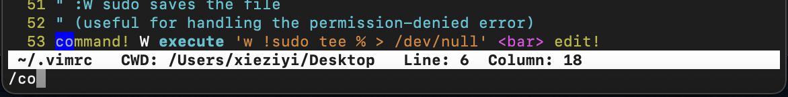

# README

------

## Vim 基础：

**命令模式与编辑模式：**`i` 、 `esc` 、 `wq zs.java`

**vim 设置语法高亮：**命令模式下 `:syntax on`

**vim 设置行号：**命令模式下 `:set number`

**在 `.vimrc` 配置文件保存配置：**`mvim ~/.vimrc`

```zsh
syntax on
set number
```

**方向移动：**⬅️↕️➡️、`H`、`J`、`K`、`L`

**词汇跳跃：**`w` =word=> 下跃、 `b` =back=> 回跳

**翻页跳跃：**`ctrl` + `F` = forward 、  `ctrl` + `B`

**指定跳跃：**`Number` + `gg`

**指定行跳跃：**`Number` + `j` \ `k`

**错误命令清除：**`esc`

**定位查找：**命令模式下 `/what` 回车则全局开启指定词汇高亮 （注意这里不要 `:`）且此时跳跃下一处高亮位按下 `n` = next ; 回退为 `shift` + `n`



完成后按下 `esc` + `i` 即可继续进行书写

**剪切行：** `cc` （这里注意使用后会跳入编辑模式）、**恢复剪切：**`u` = undo

**剪切 n 行：** `c` + Number + `c`

**粘贴此前被剪切的行：** `p` 、 **撤销粘贴：** `u` = undo

**复制特定的某一段**：把光标移到要复制的文本的头部，按下“v”，往后移动光标，光标所过之处的字符>都会高亮，移到欲复制文本的尾部后，按下“y”，高亮文本全部被复制到剪粘板。按下“p”粘贴到目的地。

**剪切特定的某一段**：把光标移到要剪切的文本的头部，按下“v”，往后移动光标，光标所过之处的字符>都会高亮，移到欲剪切文本的尾部后，按下“d”，高亮文本全部被复制到剪粘板。按下“p”粘贴到目的地

**复制到任意：** `v` 选中需要复制的内容后 `"` 再 `+` 再 `y`（仅在 nvim 中可以 v"ay）

------

## Neovim + Coc.nvim 配置：

### 安装 vim-plug：

[**Vim-plug **](https://github.com/junegunn/vim-plug)是 vim 插件 的插件管理器，支持并行安装或更新（回滚更新）插件，并通过创建浅克隆减少磁盘空间使用和下载时间。

```zsh
sh -c 'curl -fLo "${XDG_DATA_HOME:-$HOME/.local/share}"/nvim/site/autoload/plug.vim --create-dirs \
       https://raw.githubusercontent.com/junegunn/vim-plug/master/plug.vim'
```

配置文件`~/.local/share/nvim/site/autoload/plug.vim`就会在目录下被 vim\nvim 调用。

### 创建 nvim 的配置文件并写入初始 plug 段：

一般 Vim 的配置文件是 `~/.vimrc`，Neovim 的配置文件是 `~/.config/nvim/init.vim`。

```bash
$ mkdir ~/.config/nvim/
$ nvim ~/.config/nvim/init.vim
```

```zsh
# 此 call plug 段仅作为插件插入
call plug#begin('~/.vim/plugged')
call plug#end()
```

之后的每个插件在 init.vim 文件中配置好后，要进行保存退出。

进入 nvim ，进行插件相关操作：

```zsh
# 检查状态:
:PlugStatus
# 安装插件:
:PlugInstall
# 更新插件:
:PlugUpdate
# 查看更改:
:PlugDiff
# 删除插件
:PlugClean
# 升级 Vim-plug
:PlugUpgrade
```

- 插件 'morhetz/gruvbox'

```zsh
Plug 'morhetz/gruvbox'
```

- 插件 'vim-airline/vim-airline'

```zsh
Plug 'vim-airline/vim-airline'
Plug 'vim-airline/vim-airline-themes'
```

- 插件 `coc.nvim`

```zsh
" Use release branch (recommend)
Plug 'neoclide/coc.nvim', {'branch': 'release'}
```

- 保证 JDK11 安装 `coc-java`

```zsh
# 自动补全和文档的显示
:CocInstall coc-java
```

- 代码段补全

```zsh
:CocInstall coc-snippets
```

- asyncrun

```zsh
Plug 'skywind3000/asyncrun.vim'
```

------

## BUG排除：

- `coc-snippets keep reporting "no python3 provider found"` 问题：[...](https://github.com/neoclide/coc-snippets/issues/196)

```zsh
# macOS自带的vim就不支持python3
/usr/local/bin/python3 -m pip install --upgrade pip
```

- 解决乱码

如果发现显示的有乱码 => 字体的原因导致
安装nerd-font字体，并设置终端模拟器的字体为 nerd-font

```zsh
# 安装nerd-font字体
brew tap homebrew/cask-fonts
brew install font-hack-nerd-font --cask
```

------

### 关于配置：

```zsh
" --------------- Plug Start ---------------
call plug#begin('~/.vim/plugged')
" Use release branch (recommend)
Plug 'neoclide/coc.nvim', {'branch': 'release'}

" theme
Plug 'morhetz/gruvbox'

" airline
Plug 'vim-airline/vim-airline'
Plug 'vim-airline/vim-airline-themes'

" 更多实用的代码段
Plug 'honza/vim-snippets'

" nerdtree
Plug 'preservim/nerdtree'
Plug 'Xuyuanp/nerdtree-git-plugin'

" 控制台asyncrun.
Plug 'skywind3000/asyncrun.vim'
call plug#end()

" --------------- morhetz/gruvbox ---------------
" 使用 gruvbox 配色主题
autocmd vimenter * ++nested colorscheme gruvbox
" 设置色调 zs 最爱 dark 模式
set bg=dark

" --------------- vim-airline ---------------
let g:airline#extensions#tabline#enabled = 1
let g:airline_powerline_fonts = 1

" ---------------- Personal -----------------
" 光标移动设置成空格
let mapleader="<space>"
" 使用鼠标
set mouse=a
" 显示行号
set nu
" 相对行号
set relativenumber
" tab=4个空格
set tabstop=4
" 默认必要
let g:db_ui_use_nerd_fonts=1
" 高度光标所在行
set cursorline
" 设置不换行
set nowrap
" --------------- nerdtree ---------------
" 自动开启Nerdtree
autocmd vimenter * NERDTree
" 设定 NERDTree 视窗大小
let g:NERDTreeWinSize=30
" 开启Nerdtree时自动显示Bookmarks
let NERDTreeShowBookmarks=1
" 打开vim时如果没有文件自动打开NERDTree
autocmd vimenter * if !argc()|NERDTree|endif
" 当NERDTree为剩下的唯一窗口时自动关闭
autocmd bufenter * if (winnr("$") == 1 && exists("b:NERDTree") && b:NERDTree.isTabTree()) | q | endif
" 设置树的显示图标
let g:NERDTreeDirArrowExpandable = '▸'
let g:NERDTreeDirArrowCollapsible = '✭'
" 开启/关闭nerdtree快捷键
nnoremap <F1> :NERDTreeToggle<CR>
" 配置asyncrun.vim
map <F5> :call Runcode()<CR>
func! Runcode()
     exec "w"
       if &filetype == 'python'
           if search("@profile")
               exec "AsyncRun kernprof -l -v %"
               exec "copen"
               exec "wincmd p"
           elseif search("set_trace()")
               exec "!python3 %"
           else
               exec "AsyncRun -raw python3 %"
               exec "copen"
               exec "wincmd p"
           endif
      elseif &filetype == 'c'
          exec "AsyncRun! gcc % -o %<; time ./%<"
      elseif &filetype == 'cpp'
          exec "AsyncRun! g++ -std=c++11 % -o %<; time ./%<"
          exec "copen"
          exec "wincmd p"
      elseif &filetype == 'java'
          exec "AsyncRun! javac %; time java %<"
		  cope 8 "启动 quickfix 窗口, 设置窗口大小为8
      endif
endfunc
```

------

## 后话：

**这里说几点：**

- Mac M1 芯片不支持 xournal plus plus version 1.0.20，而 @1.0.19可以使用
- NVM 在 mac m1 芯片不支持前 node 版本。现已卸载 NVM 重新从 HomeBrew 下载 Node -v15（已解决此问题-改架构）
- `:copen` #打开quickfix窗口
- `:ccolse` #关闭quickfix窗口
- NVIM快捷键：PSVM\sout\copen\close\sout

